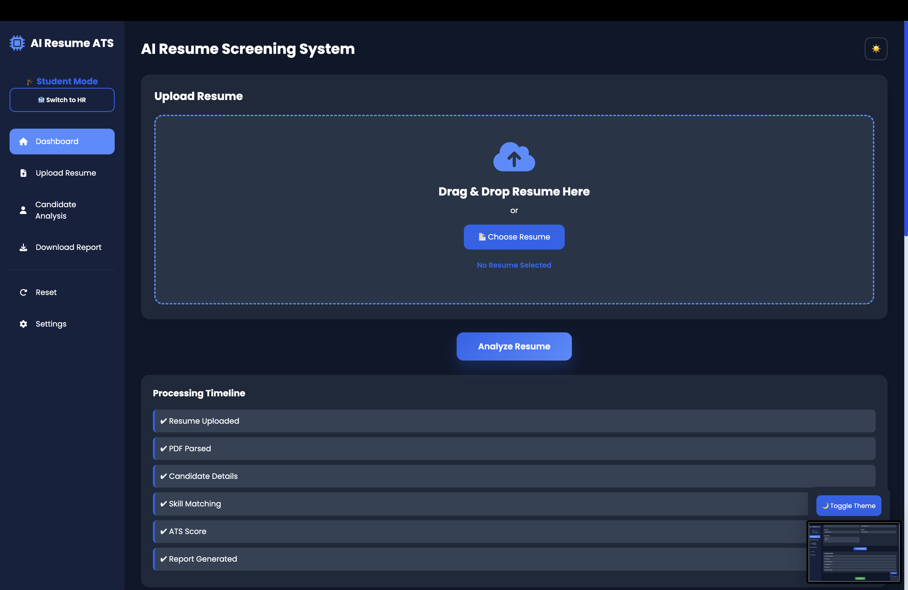
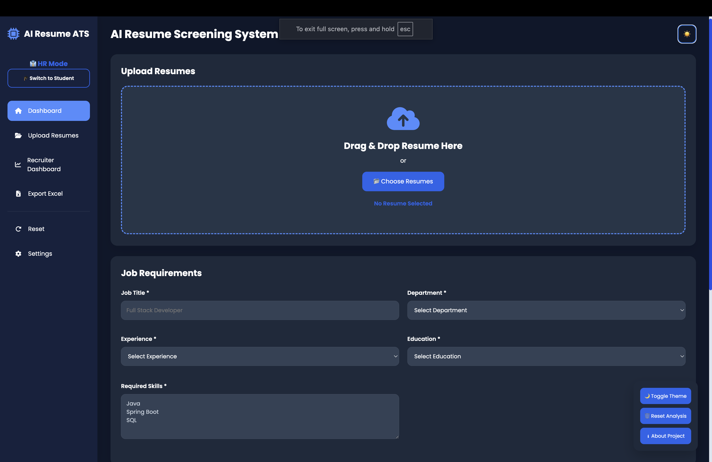
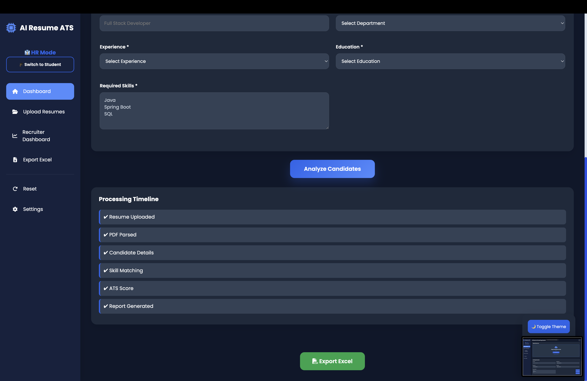
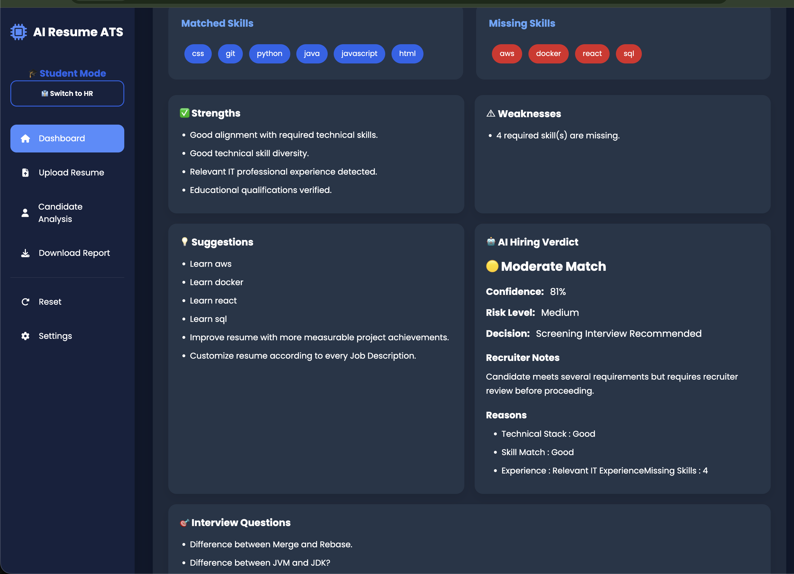
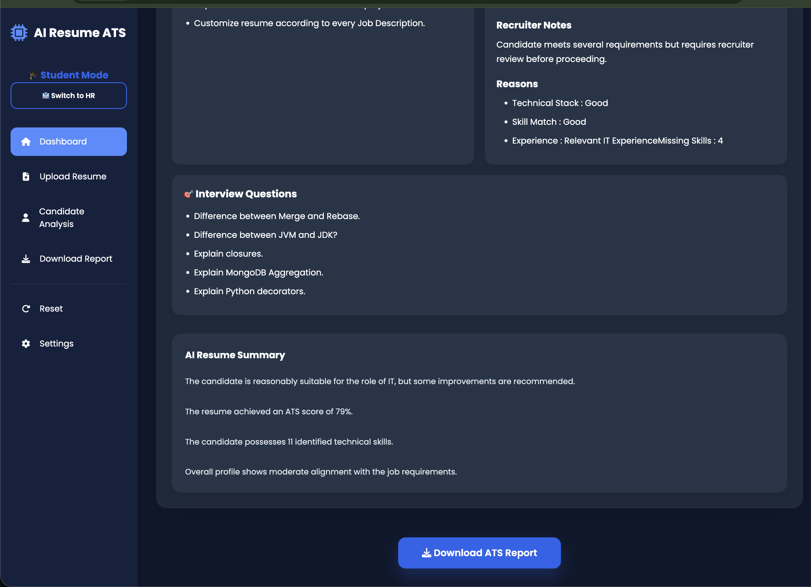
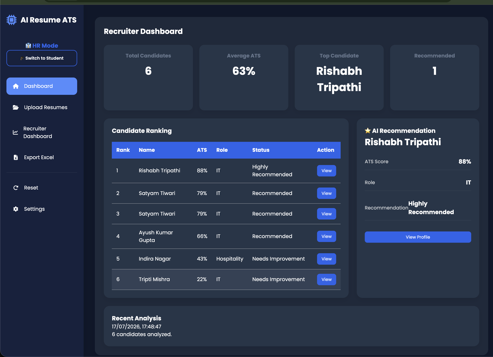
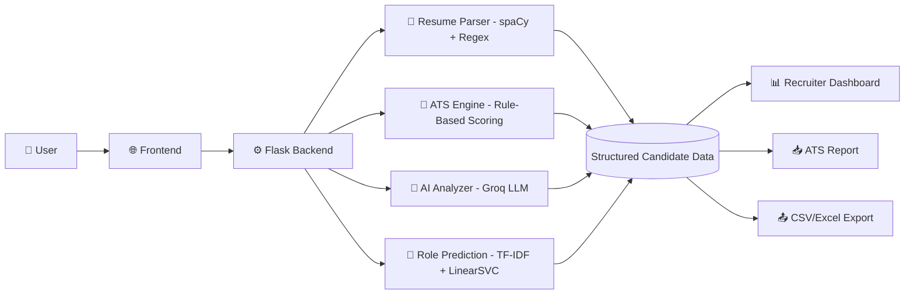
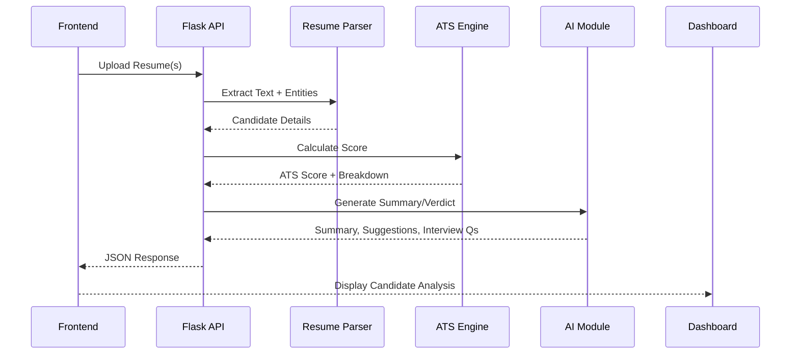

# 🤖 AI Resume Screening & Candidate Ranking System

An AI/ML-powered recruitment platform that parses resumes, matches them against job requirements, generates an ATS compatibility score, and produces AI-written candidate feedback — for both **job seekers** (Student Mode) and **recruiters** (HR Mode).

Built as a full-stack project combining Flask, a trained ML resume classifier, NLP-based parsing, and an LLM (Groq/Llama-3.3-70B) for recruiter-style analysis.

---

## 🔗 Links

| | |
|---|---|
| 🖥️ Live Demo | (https://ai-resume-screening-system-iv0e.onrender.com/) |
| 💻 GitHub Repo | [Satyamtiwari23/ai-resume-screening-system](https://github.com/Satyamtiwari23/ai-resume-screening-system.git) |
| 🌐 Portfolio | [satyamtiwari23.github.io/Portfolio](https://satyamtiwari23.github.io/Portfolio) |
| 💼 LinkedIn | [Satyam Tiwari](https://www.linkedin.com/in/satyam-tiwari-8s5a4t3y8a7m4104/) |

---

## 📌 Why This Project

Manual resume screening doesn't scale — recruiters skim hundreds of resumes per role, and candidates rarely get feedback on why they weren't shortlisted. This project builds both sides of that problem into one tool: a **student-facing mode** that gives candidates an honest ATS score and improvement suggestions, and a **recruiter-facing mode** that ranks multiple candidates automatically against a job description.

---

## 🖼️ Screenshots

### Student Mode — Resume Upload
Candidates upload a single resume and get instant, personalized feedback.



### HR Mode — Job Requirements
Recruiters upload multiple resumes at once and define the role's requirements (title, department, experience, education, required skills).



### Resume Processing Timeline
Every analysis run shows the live pipeline stages — upload, PDF parsing, candidate extraction, skill matching, ATS scoring, report generation.



### Candidate Analysis Report
Full breakdown per candidate: matched/missing skills, strengths, weaknesses, AI hiring verdict, and auto-generated interview questions.



### AI Resume Summary
An LLM-generated summary of the candidate's profile alongside a downloadable ATS report.



### Recruiter Dashboard
Aggregated view for HR: total candidates, average ATS score, top candidate, and a ranked comparison table.



---

## ✨ Features

### 👨‍🎓 Student Mode
- Single resume upload with instant analysis
- ATS score with category-wise breakdown
- Missing skill detection + improvement suggestions
- AI-generated resume summary
- Auto-generated interview questions
- Downloadable ATS report

### 👨‍💼 HR Mode
- Multi-resume upload with automatic candidate ranking
- Custom job requirement form (title, department, experience, education, required skills)
- Recruiter dashboard with aggregate stats (avg ATS score, top candidate, recommended count)
- CSV/Excel export of ranked candidates
- Per-candidate AI hiring verdict with confidence & risk level

### 🎨 General
- Dark mode
- Responsive layout (desktop / tablet / mobile)
- Drag-and-drop resume upload with PDF validation

---

## 🧠 How the "AI" Actually Works (Transparency Section)

Different parts of this system use genuinely different techniques — being upfront about which is which:

| Component | How it works |
|---|---|
| **Role Prediction** | Real ML — TF-IDF + LinearSVC (and a Sentence-BERT + RandomForest variant), trained on a merged, cleaned dataset of resumes across categories (IT, Business, Finance, HR, etc.) |
| **ATS Scoring** | Deterministic, rule/keyword-weighted scoring across 6 categories (Skills, Experience, Education, Projects, Resume Quality, Certifications) — not a learned model. Transparent and explainable by design. |
| **Skill Extraction** | Regex/keyword matching against a curated skills list |
| **Name/Entity Extraction** | spaCy NER (`en_core_web_trf`) with fallback rules (resume header lines → email username → filename) |
| **Resume Summary, Strengths/Weaknesses, Suggestions, Interview Questions, Hiring Verdict** | Currently a rule-based expert-system engine — score thresholds and profile flags (skill match level, technical diversity, experience type) map to pre-written templates and a fixed interview-question bank. Fully deterministic and explainable. |
| **JD Analysis (LLM)** | A Groq API module (Llama-3.3-70B) that extracts structured role/skills/experience data from a raw job description is already built and tested independently — it is being wired into the main candidate-feedback pipeline next, to replace/augment the rule-based feedback engine above with LLM-generated summaries and suggestions. |

This separation is intentional — the ATS score stays consistent and auditable regardless of which feedback engine is active, and the LLM layer is being integrated as an enhancement on top of an already-working rule-based baseline (with the rule-based engine kept as a fallback).

---

## 📊 Model Performance

The role-classification model (TF-IDF + LinearSVC, tuned via `GridSearchCV`) currently achieves **85.10% accuracy** on the held-out test split, after merging and cleaning six public resume datasets and mapping ~50 raw categories down to 15 supported role categories.

A Sentence-BERT embedding + RandomForest variant (`train_model_bert.py`) was also trained as a comparison baseline.

---

## 🏗️ System Architecture



### Response Flow



---

## 💻 Technology Stack

**Frontend** — HTML5, CSS3, JavaScript

**Backend** — Python, Flask, Flask-CORS

**Machine Learning** — Scikit-learn, TF-IDF, LinearSVC, Sentence-BERT (comparison model), Joblib

**NLP** — spaCy (`en_core_web_trf`), Regex-based extraction, pdfplumber

**AI Layer** — Groq API (Llama-3.3-70B) for resume summaries, suggestions, and hiring verdicts

**Deployment (planned)** — Gunicorn, Render

---

## 📡 API Reference

### `POST /upload`

Uploads one or multiple PDF resumes, extracts candidate information, runs ATS scoring, predicts job role, and returns AI-generated feedback.

**Request** — `multipart/form-data`

| Parameter | Type | Required | Description |
|-----------|------|----------|-------------|
| `resumes` | File | ✅ | One or more PDF resumes |
| `requiredSkills` | String | ❌ | Newline-separated required skills |
| `jobRole` | String | ❌ | Job title (recruiter mode) |
| `department` | String | ❌ | Department name |
| `experience` | String | ❌ | Required experience |
| `education` | String | ❌ | Required qualification |

**Response (single resume — Student Mode)**

```json
{
  "candidate": {
    "name": "John Doe",
    "email": "john@example.com",
    "phone": "+91XXXXXXXXXX",
    "education": "Bachelor of Technology",
    "experience": "Fresher",
    "resume": "john_resume.pdf"
  },
  "predictedRole": "IT",
  "score": 79,
  "matchedSkills": ["python", "css", "git"],
  "missingSkills": ["aws", "docker"],
  "summary": "AI-generated candidate summary...",
  "recommendation": "Recommended"
}
```

**Response (multiple resumes — HR Mode)** returns a `candidates` array, sorted by score, descending.

**Error Response**

```json
{ "error": "No Resume Uploaded" }
```

---

## ⚙️ Installation Guide

```bash
# 1. Clone the repository
git clone https://github.com/Satyamtiwari23/ai-resume-screening-system.git

# 2. Move into the project directory
cd ai-resume-screening-system

# 3. Create a virtual environment
python -m venv venv

# 4. Activate it
# Windows
venv\Scripts\activate
# Linux / macOS
source venv/bin/activate

# 5. Install dependencies
pip install -r requirements.txt

# 6. Create a .env file
echo "GROQ_API_KEY=your_api_key_here" > .env

# 7. Run the Flask app
python app.py
```

The app runs locally at:

```text
http://127.0.0.1:5001
```

---

## ☁️ Deployment Guide (Render)

1. Push the project to GitHub
2. Create a Render account and a new **Web Service**
3. Connect the GitHub repository
4. Configure:
   - **Runtime:** Python
   - **Build Command:** `pip install -r requirements.txt`
   - **Start Command:** `gunicorn app:app`
5. Add environment variable `GROQ_API_KEY`
6. Deploy

---

## 📈 Planned Improvements

- [ ] **Wire the existing Groq LLM module (JD analysis) into the main candidate-feedback pipeline** — the model integration is already built and tested standalone; next step is connecting it in place of / alongside the rule-based feedback engine, with the rule-based version kept as a fallback
- [ ] Deploy live demo on Render
- [ ] User authentication (recruiter & candidate login)
- [ ] Resume history and version tracking
- [ ] DOCX resume support (currently PDF only)
- [ ] Improve role-classification accuracy further with a larger, more balanced dataset
- [ ] Docker support for easier local setup

---

## 🤝 Contributing

Contributions are welcome:

1. Fork the repository
2. Create a feature branch
3. Commit your changes
4. Push the branch
5. Open a Pull Request

---

## 📜 License

Licensed under the **MIT License** — free to use, modify, and distribute for educational and personal purposes.

---

## 👨‍💻 Author

**Satyam Tiwari**
B.Tech Information Technology, Rajkiya Engineering College, Mainpuri (AKTU)

[Portfolio](https://satyamtiwari23.github.io/Portfolio) · [GitHub](https://github.com/Satyamtiwari23) · [LinkedIn](https://www.linkedin.com/in/satyam-tiwari-8s5a4t3y8a7m4104/)

---

## 🙏 Acknowledgements

Built with Flask, Scikit-learn, spaCy, pdfplumber, and the Groq API.
